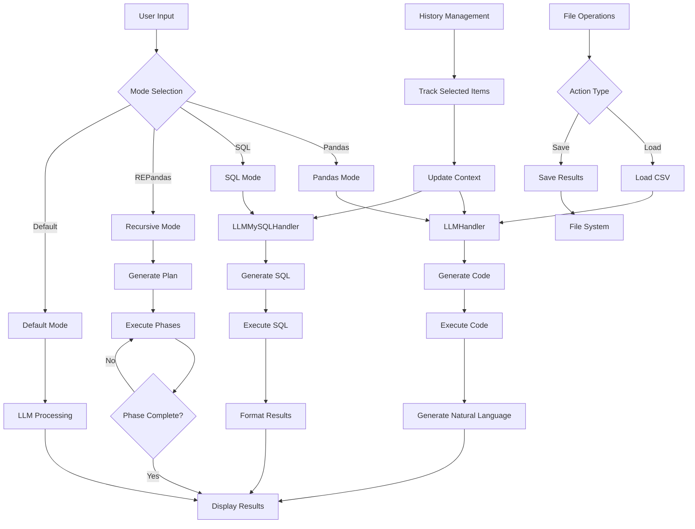

# Prompt2query

# Prompt2Query

**Prompt2Query** is a desktop application built using `tkinter` that enables users to input natural language prompts, generate corresponding code, and execute it using the `llm_pandas` library. This tool is specifically designed for interacting with data using Python code, providing an intuitive interface to query datasets with natural language.


## Flow chart


## Features

- **Natural Language to Code**: Convert user queries written in natural language to executable code using `llm_pandas`.
- **Multiple Modes**: Currently supports both Pandas and SQL modes for generating queries.
- **File Attachment**: Load CSV files to query data.
- **Code Execution**: Execute the generated code directly within the application.
- **Scrollable Result Logs**: View query results and logs in a clean, organized, scrollable interface.
- **Interactive Interface**: Buttons and dropdowns for a seamless user experience.
- **Query History**: Track and review previous queries and their corresponding code and results.

## Installation

1. Clone the repository:
    ```bash
    git clone https://github.com/Abhigyan126/Prompt2query.git
    ```

2. Navigate into the project directory:
    ```bash
    cd prompt2query
    ```

3. Install the required dependencies:
    ```bash
    pip install tkinter google-generativeai
    ```

4. Run the application:
    ```bash
    python Begin.py
    ```

## Usage

- **Load a Dataset**: Use the "Attachment" button to upload a CSV file.
- **Enter Query**: Type your query in the input box at the bottom right of the window.
- **Execute**: Choose between Pandas or SQL mode from the dropdown, and click the "Execute" button to generate and run the corresponding code.
- **View Results**: The generated code and results will appear in the respective panes on the left-hand side.
- **Log**: All executed queries and results are logged for easy reference.

## Dependencies

- `tkinter`: For the graphical user interface.
- `llm_pandas`: To handle natural language queries and generate code.
- `datetime`: For timestamping query logs.

## Project Structure

```bash
.
├── Icons                  # Folder containing application icons
├── Begin.py               # Main application script
├── llm_pandas             # Library to generate code
├── llm.py                 # Library to comunicate with LLM here in this cose gemini by google
└── README.md              # Project documentation
